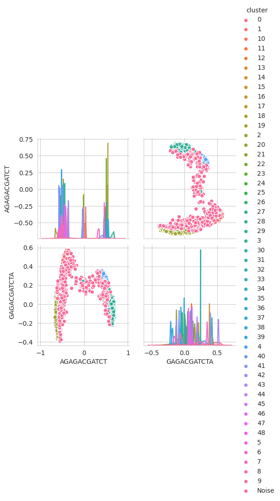

# IlPhaBuce1 filtering of PacBio CCS reads

This is a first try to identify co-bionts PacBio HiFi reads prior to assembly.

## Step 1: GC content - Producing a lavalamp plot
One of the first ideas is to plot the GC% of the reads. Lava lamp plots can show different GC content of symbiont species in the sample, for example. Bellow you find a 3D lavalamp plot for all IlPhaBuCe1 HiFi reads kmer=31. For more information on Lavalamp plots: https://github.com/wrf/lavaLampPlot

## GC% only for wolbachia reads
As the GC content of the wolbachia reads (indentifed after assembly) do not deviate much of the species reads we don't see them in the lavalamp plot.

# Step 2: Identifying co-bionts possible reads: 
## Wolbachia
I've downloaded 54 sequences of 16S wolbachia endosymbionts of various organisms from ENA, created an aligment from them with clustalw and have input it to a nhmmer search against all IlPhaBuce1 PacBio reads.

`hmmbuild --dna wolbachia.ena.some.hmm  wolbachia.ena.fasta.aln`
`nhmmer --cpu 30 --tblout <output.tbl> wolbachia.ena.some.hmm <all.HiFi.fasta>`

> This has identified 9271 reads. 

### Step 2.2: Clustering
So the next idea was to take these first identified reads cluster them and inquire if it would be worth to search more deeply for reads of this organism to do genome assembly. I have used PacBio tool pbampliconclustering for such https://github.com/PacificBiosciences/pbampliconclustering 

`python ClusterAmplicons.py cluster -j 20 -g 2 -X -p <out.file> -F -Q <fastq_file_to_cluster.fasq>`

>This program has classified 577 reads as noise, and has created 49 clusters with the following nreads 3469,2889,522,521,468,247,92,40,32,31,29,23,23,16,15,14,12,10,10,9,9,9,9,8,8,7,7,6,6,6,6,6,6,6,5,5,5,5,5,5,5,5,5,5,5,5,5,3,3

PCA of the above clusters generated by pbampliconclustering

Lots of things to discuss here:
1. Good to remember we have assembled 2 wolbachia genomes within HiCanu totalizing 23151reads. These are the reads for which GC% is plotted in Step1
2. For the 9271 reads identified with the hnmmer profile of 16S wolbachia endosymbiont, only 64 are the reads assembled as wolbachia with Hicany. Why so few? 
3. If I do a blast search of the 16S sequences used in the nhmer profile with the wolbachias assembled by Hicanu, I don't find matches for the 2 well assembled genomes, only for the fragments `/lustre/scratch116/vr/projects/vgp/user/mu2/ilPhaBuce1/wolbachia/blast/ilPhaBuce_wolbAll.fawolbachia.ena.fastaALL.blastn.cov `

    3.1. This brings up a question about which marker to use to really fish the reads out in this expedition.
    
    3.2. I've done a prokka annotation of scaffold_16 (one assembled wolbachia): `/lustre/scratch116/vr/projects/vgp/user/mu2/ilPhaBuce1/wolbachia/annotation_assembled_wol `

